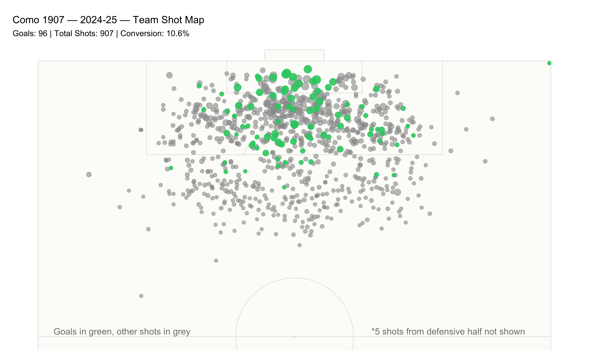

# Como 1907 — 2024-25 — shot map
Michael Royce

- [Pre-req](#pre-req)
- [1. Import Como 1907 team shots
  data](#1-import-como-1907-team-shots-data)
- [2. Create plot visualizing team shots
  data](#2-create-plot-visualizing-team-shots-data)

### Pre-req

``` r
# Load libraries
library(worldfootballR)  # Package for accessing Understat data
library(ggplot2)         # Main plotting package
library(ggsoccer)        # Package for creating soccer/football pitch visualizations
library(dplyr)           # Data manipulation package
library(here)            # simplify file paths by anchoring them to your project root
```

### 1. Import Como 1907 team shots data

``` r
# Load Como 1907 team shots data (data from understat)
como.2024.team.shot <- readRDS(here("data", "raw", "ustat-como-2024-team-shot.rds"))
```

### 2. Create plot visualizing team shots data

``` r
# Calculate shots not shown (defensive half)
como.2024.shots.not.shown <- como.2024.team.shot %>% 
  filter(X * 100 < 50) %>% 
  nrow()

# Calculate descriptive statistics
como.2024.shot.stats <- como.2024.team.shot %>%
  summarise(
    total.shots = n(),
    goals = sum(result == "Goal"),
    conversion.rate = round((goals / total.shots) * 100, 1)
  )

# Create subtitle with stats
como.2024.shot.stats.subtitle <- paste0(
  "Goals: ", como.2024.shot.stats$goals, " | ",
  "Total Shots: ", como.2024.shot.stats$total.shots, " | ",
  "Conversion: ", como.2024.shot.stats$conversion.rate, "%"
)


# Create the half-pitch shot map (minimal)
ggplot(como.2024.team.shot) +
  
  # Add a ivory white shade pitch with minimal lines
  annotate_pitch(colour = "grey90", fill = "#FCFCF9", limits = FALSE) + 
  
  # Plot all non-goal shots in grey first (bottom layer)
  geom_point(data = filter(como.2024.team.shot, result != "Goal"),
             aes(x = X * 100, y = (1-Y) * 100, size = xG),
             color = "grey60", alpha = 0.6) +
  
  # Plot goals in green on top (top layer)  
  geom_point(data = filter(como.2024.team.shot, result == "Goal"),
             aes(x = X * 100, y = (1-Y) * 100, size = xG),
             color = "#2ECC71", alpha = 0.9) +
  
  # Control point sizes based on xG values
  scale_size_continuous(range = c(2, 6), guide = "none") +
  
  # Show only attacking half of pitch
  coord_flip(xlim = c(50, 100), ylim = c(0, 100)) +
  
  # Reverse Y-axis for correct orientation
  scale_y_reverse() +
  
  # minimal, remove axes, grids, legends
  theme_void() +
  theme(
    plot.margin = margin(t = 20, r = 20, b = 20, l = 20, unit = "pt"),
    plot.title = element_text(size = 16),
    plot.subtitle = element_text(margin = margin(t = 8, b = 15), size = 13)
  ) +
  
  # minimal titles
  labs(
    title = "Como 1907 — 2024-25 — Team Shot Map", 
    subtitle = como.2024.shot.stats.subtitle
  ) +

# Add text showing hidden shots count
  annotate("text", x = 51, y = 95, 
           label = paste0("*", como.2024.shots.not.shown, " shots from defensive half not shown"),      # paste0()
           size = 5, color = "grey50", hjust = 1) +
  
  # Add text 
  annotate("text", x = 51, y = 3, 
           label = "Goals in green, other shots in grey",   
           size = 5, color = "grey50", hjust = 0) 
```



Reference:

- [worldfootballR](https://jaseziv.github.io/worldfootballR/)
- [ggsoccer](https://github.com/Torvaney/ggsoccer)
