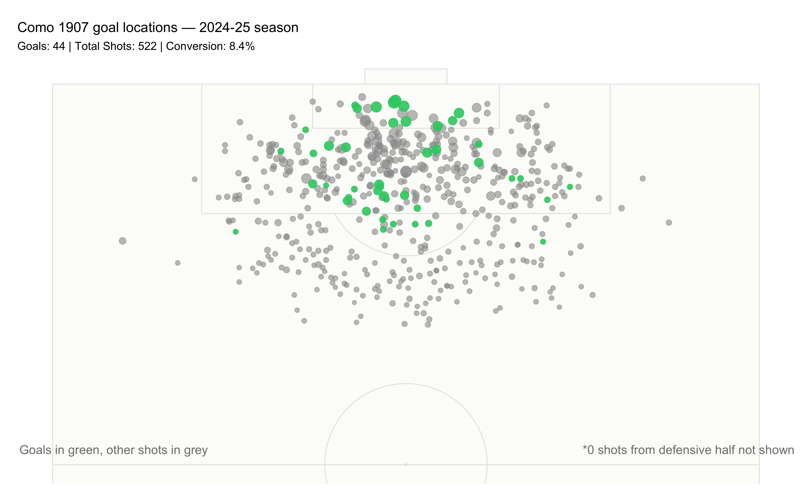
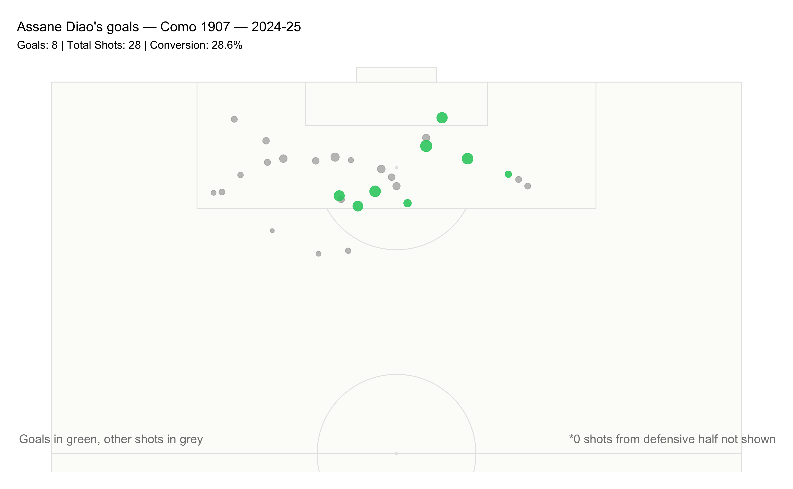

# Como 1907 — Goals-Scoring Patterns — 2024-25 Season
Michael Royce

- [Pre-req](#pre-req)
- [1. Importing data](#1-importing-data)
- [2. Como 1907 goal locations — 2024-25
  season](#2-como-1907-goal-locations--2024-25-season)
- [3. Como 1907 goal scoring zones — 2024-25
  season](#3-como-1907-goal-scoring-zones--2024-25-season)
- [4. Assane Diao’s goals — Como 1907 —
  2024-25](#4-assane-diaos-goals--como-1907--2024-25)
- [5. Assane Diao’s scoring zones — Como 1907 —
  2024-25](#5-assane-diaos-scoring-zones--como-1907--2024-25)
- [6. Stats Table](#6-stats-table)

### Pre-req

``` r
# Load libraries
library(worldfootballR)  # Package for accessing Understat data
library(ggplot2)         # Main plotting package
library(ggsoccer)        # Package for creating soccer/football pitch visualizations
library(dplyr)           # Data manipulation package
library(here)            # simplify file paths by anchoring them to your project root
library(janitor)         # Package for data cleaning and adding total rows to tables
library(knitr)           # Package for creating formatted tables with kable()
library(stringr)         # Package for consistent and readable string manipulation functions
```

### 1. Importing data

``` r
# Load como 1907 team shots data (data from understat) 
como.2024.team.shot <- readRDS(here("data", "raw", "ustat_como_team_shot_2024_25.rds"))

# Load como players data
como.2024.players.stats <- readRDS(here("data", "raw", "ustat_como_player_stats_url_2024_25.rds"))

# filter to only como players -- data includes data from other teams that como has played against
como.2024.team.shot <- como.2024.team.shot %>%
  mutate(player_id = as.numeric(player_id)) %>% 
  semi_join(
    como.2024.players.stats %>% 
    select(player_id), by = c("player_id" = "player_id"))

# alternatively
# como.2024.team.shot <- como.2024.team.shot %>%
#   mutate(player_id = as.numeric(player_id)) %>% 
#   filter(player_id %in% como.2024.players$player_id)
```

### 2. Como 1907 goal locations — 2024-25 season

``` r
# Calculate shots not shown (defensive half)
como.2024.shots.not.shown <- como.2024.team.shot %>% 
  filter(X * 100 < 50) %>% 
  nrow()

# Calculate descriptive statistics
como.2024.shot.stats <- como.2024.team.shot %>%
  filter(!is.na(result)) %>% 
  summarise(
    total.shots = n(),
    goals = sum(result == "Goal"),
    conversion.rate = round((goals / total.shots) * 100, 1)
  )

# Create subtitle with stats
como.2024.shot.stats.subtitle <- paste0(
  "Goals: ", como.2024.shot.stats$goals, " | ",
  "Total Shots: ", como.2024.shot.stats$total.shots, " | ",
  "Conversion: ", como.2024.shot.stats$conversion.rate, "%"
)

# Create the half-pitch shot map (minimal)
ggplot() +
  
  # Add a ivory white shade pitch with minimal lines
  annotate_pitch(colour = "grey90", fill = "#FCFCF9", limits = FALSE) + 
  
  # Plot all non-goal shots in grey first (bottom layer)
  geom_point(data = filter(como.2024.team.shot, result != "Goal"),
             aes(x = X * 100, y = Y * 100, size = xG),
             color = "grey60", alpha = 0.6) +
  
  # Plot goals in green on top (top layer)  
  geom_point(data = filter(como.2024.team.shot, result == "Goal"),
             aes(x = X * 100, y = Y * 100, size = xG),
             color = "#2ECC71", alpha = 0.9) +
  
  # Control point sizes based on xG values
  scale_size_continuous(range = c(2, 6), guide = "none") +
  
  # Show only attacking half of pitch
  coord_flip(xlim = c(50, 100)) +        # or include 'ylim = c(100, 0)' but remove 'scale_y_reverse()'
  
  # Reverse Y-axis for correct orientation
  scale_y_reverse() +
  
  # minimal, remove axes, grids, legends
  theme_void() +
  theme(
    plot.margin = margin(t = 20, r = 20, b = 20, l = 20, unit = "pt"),
    plot.title = element_text(size = 16),
    plot.subtitle = element_text(margin = margin(t = 8, b = 15), size = 13)
  ) +
  
  # minimal titles
  labs(
    title = "Como 1907 goal locations — 2024-25 season", 
    subtitle = como.2024.shot.stats.subtitle
  ) +

  # Add text showing hidden shots count
  annotate("text", x = 52, y = 25, 
           label = paste0("*", como.2024.shots.not.shown, " shots from defensive half not shown"),      # paste0()
           size = 5, color = "grey50", hjust = 0) +
  
  # Add text 
  annotate("text", x = 52, y = 78, 
           label = "Goals in green, other shots in grey",   
           size = 5, color = "grey50", hjust = 1) 
```



### 3. Como 1907 goal scoring zones — 2024-25 season

``` r
# Create density/heat map of shots
ggplot() +
  annotate_pitch(colour = "grey90", fill = "#FCFCF9", limits = FALSE) +
  stat_density_2d_filled(data = filter(como.2024.team.shot, result == "Goal"), 
                         mapping = aes(x = X * 100, y = Y * 100), 
                         alpha = 0.3, 
                         bins = 9
                         ) +
  coord_flip(xlim = c(60, 100)) +
  scale_y_reverse() +
  # scale_fill_viridis_d(option = "magma") +
  # scale_fill_brewer(palette = "YlOrBr") +  # Warm tones
  scale_fill_brewer(palette = "Greens") +
  theme_void() +
  theme_pitch() +
  theme(
    legend.position = "none",
    plot.margin = margin(t = 20, r = 20, b = 20, l = 20, unit = "pt"),
    plot.title = element_text(size = 16),
    plot.subtitle = element_text(margin = margin(t = 8, b = 15), size = 13)
    ) +
  labs(title = "Como 1907 goal scoring zones — 2024-25 season", 
       subtitle = "Density of goals scoring zones")
```


### 4. Assane Diao’s goals — Como 1907 — 2024-25

``` r
# find player_id for Assane Diao
como.2024.team.shot %>% 
  filter(player == "Assane Diao") %>% 
  distinct(player_id)
```

      player_id
    1     12081

``` r
# alternatively
# como.2024.team.shot %>% 
#  filter(str_detect(player, "Diao")) %>% 
#  distinct(player_id)


# Calculate shots not shown (defensive half)
adiao.como.2024.shots.not.shown <- como.2024.team.shot %>% 
  filter(X * 100 < 50, player_id == 12081) %>% 
  nrow()

# Calculate descriptive statistics
adiao.como.2024.shot.stats <- como.2024.team.shot %>%
  filter(!is.na(result), player_id == 12081) %>% 
  summarise(
    total.shots = n(),
    goals = sum(result == "Goal"),
    conversion.rate = round((goals / total.shots) * 100, 1)
  )

# Create subtitle with stats
adiao.como.2024.shot.stats.subtitle <- paste0(
  "Goals: ", adiao.como.2024.shot.stats$goals, " | ",
  "Total Shots: ", adiao.como.2024.shot.stats$total.shots, " | ",
  "Conversion: ", adiao.como.2024.shot.stats$conversion.rate, "%"
)

# Create the half-pitch shot map (minimal)
ggplot() +
  
  # Add a ivory white shade pitch with minimal lines
  annotate_pitch(colour = "grey90", fill = "#FCFCF9", limits = FALSE) + 
  
  # Plot all non-goal shots in grey first (bottom layer)
  geom_point(data = filter(como.2024.team.shot, result != "Goal"),
             aes(x = X * 100, y = Y * 100, size = xG),
             color = "grey60", alpha = 0.6) +
  
  # Plot goals in green on top (top layer)  
  geom_point(data = filter(como.2024.team.shot, result == "Goal", player_id == 12081),
             aes(x = X * 100, y = Y * 100, size = xG),
             color = "#2ECC71", alpha = 0.9) +
  
  # Control point sizes based on xG values
  scale_size_continuous(range = c(2, 6), guide = "none") +
  
  # Show only attacking half of pitch
  coord_flip(xlim = c(50, 100)) +        # or include 'ylim = c(100, 0)' but remove 'scale_y_reverse()'
  
  # Reverse Y-axis for correct orientation
  scale_y_reverse() +
  
  # minimal, remove axes, grids, legends
  theme_void() +
  theme(
    plot.margin = margin(t = 20, r = 20, b = 20, l = 20, unit = "pt"),
    plot.title = element_text(size = 16),
    plot.subtitle = element_text(margin = margin(t = 8, b = 15), size = 13)
  ) +
  
  # minimal titles
  labs(
    title = "Assane Diao's goals — Como 1907 — 2024-25", 
    subtitle = adiao.como.2024.shot.stats.subtitle
  ) +

  # Add text showing hidden shots count
  annotate("text", x = 52, y = 25, 
           label = paste0("*", como.2024.shots.not.shown, " shots from defensive half not shown"),      # paste0()
           size = 5, color = "grey50", hjust = 0) +
  
  # Add text 
  annotate("text", x = 52, y = 78, 
           label = "Goals in green, other shots in grey",   
           size = 5, color = "grey50", hjust = 1) 
```



### 5. Assane Diao’s scoring zones — Como 1907 — 2024-25

``` r
# Create density/heat map of shots
ggplot() +
  annotate_pitch(colour = "grey90", fill = "#FCFCF9", limits = FALSE) +
  stat_density_2d_filled(data = filter(como.2024.team.shot, result == "Goal", player_id == 12081), 
                         mapping = aes(x = X * 100, y = Y * 100), 
                         alpha = 0.3, 
                         bins = 9
                         ) +
  coord_flip(xlim = c(60, 100)) +
  scale_y_reverse() +
  # scale_fill_viridis_d(option = "magma") +
  # scale_fill_brewer(palette = "YlOrBr") +  # Warm tones
  scale_fill_brewer(palette = "Greens") +
  theme_void() +
  theme_pitch() +
  theme(
    legend.position = "none",
    plot.margin = margin(t = 20, r = 20, b = 20, l = 20, unit = "pt"),
    plot.title = element_text(size = 16),
    plot.subtitle = element_text(margin = margin(t = 8, b = 15), size = 13)
    ) +
  labs(title = "Assane Diao's scoring zones — Como 1907 — 2024-25", 
       subtitle = "Density of goals scoring zones")
```


### 6. Stats Table

``` r
# Add total row using janitor's adorn_totals function
como.2024.players.stats.totals <- como.2024.players.stats %>% 
  select(season, player_name, games, shots, assists, goals) %>% 
  arrange(desc(goals)) %>% 
  adorn_totals(
    where = "row", 
    fill = "Total", 
    name = "Total",
    shots, assists, goals,
    na.rm = TRUE) %>% 
  kable(
    col.names = c("Season", "Player", "Games", "Shots", "Assists", "Goals")
  )

como.2024.players.stats.totals
```

| Season    | Player                 | Games | Shots | Assists | Goals |
|:----------|:-----------------------|:------|------:|--------:|------:|
| 2024/2025 | Assane Diao            | 15    |    28 |       1 |     8 |
| 2024/2025 | Patrick Cutrone        | 33    |    69 |       4 |     7 |
| 2024/2025 | Gabriel Strefezza      | 37    |    57 |       4 |     6 |
| 2024/2025 | Nico Paz               | 35    |   110 |       8 |     6 |
| 2024/2025 | Lucas Da Cunha         | 36    |    37 |       2 |     3 |
| 2024/2025 | Andrea Belotti         | 18    |    19 |       0 |     2 |
| 2024/2025 | Jonathan Ikone         | 13    |    16 |       0 |     2 |
| 2024/2025 | Maxence Caqueret       | 18    |     8 |       3 |     2 |
| 2024/2025 | Tasos Douvikas         | 13    |    14 |       2 |     2 |
| 2024/2025 | Edoardo Goldaniga      | 32    |    12 |       0 |     1 |
| 2024/2025 | Luca Mazzitelli        | 11    |     7 |       1 |     1 |
| 2024/2025 | Mergim Vojvoda         | 11    |     4 |       2 |     1 |
| 2024/2025 | Yannick Engelhardt     | 26    |     8 |       1 |     1 |
| 2024/2025 | Alessandro Gabrielloni | 15    |     5 |       1 |     1 |
| 2024/2025 | Alieu Fadera           | 28    |    28 |       3 |     1 |
| 2024/2025 | Alberto Moreno         | 24    |    14 |       0 |     0 |
| 2024/2025 | Dele Alli              | 1     |     0 |       0 |     0 |
| 2024/2025 | Daniele Baselli        | 2     |     0 |       0 |     0 |
| 2024/2025 | Emil Audero            | 8     |     1 |       0 |     0 |
| 2024/2025 | Federico Barba         | 7     |     2 |       0 |     0 |
| 2024/2025 | José Reina             | 12    |     0 |       0 |     0 |
| 2024/2025 | Simone Verdi           | 9     |     2 |       0 |     0 |
| 2024/2025 | Sergi Roberto          | 13    |     6 |       1 |     0 |
| 2024/2025 | Marc-Oliver Kempf      | 31    |    20 |       0 |     0 |
| 2024/2025 | Alberto Cerri          | 5     |     4 |       0 |     0 |
| 2024/2025 | Jean Butez             | 19    |     0 |       0 |     0 |
| 2024/2025 | Ben Kone               | 4     |     1 |       0 |     0 |
| 2024/2025 | Oliver Abildgaard      | 1     |     0 |       0 |     0 |
| 2024/2025 | Máximo Perrone         | 26    |    10 |       3 |     0 |
| 2024/2025 | Alberto Dossena        | 23    |    12 |       2 |     0 |
| 2024/2025 | Álex Valle             | 15    |     9 |       0 |     0 |
| 2024/2025 | Marco Sala             | 8     |     0 |       0 |     0 |
| 2024/2025 | Matthias Braunöder     | 8     |     2 |       0 |     0 |
| 2024/2025 | Alessio Iovine         | 10    |     1 |       0 |     0 |
| 2024/2025 | Ali Jasim              | 2     |     0 |       0 |     0 |
| 2024/2025 | Ignace Van der Brempt  | 20    |     7 |       1 |     0 |
| 2024/2025 | Fellipe Jack           | 7     |     0 |       0 |     0 |
| 2024/2025 | Ivan Smolcic           | 9     |     7 |       0 |     0 |
| Total     | Total                  | Total |   520 |      39 |    44 |

Reference:

- [worldfootballR](https://jaseziv.github.io/worldfootballR/)
- [ggsoccer](https://github.com/Torvaney/ggsoccer)
