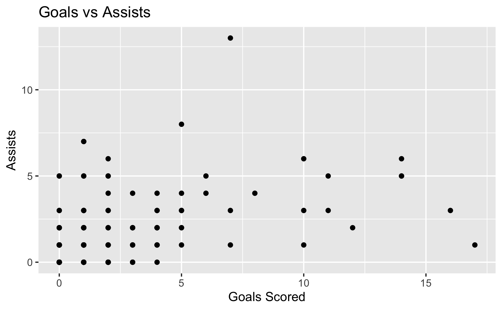
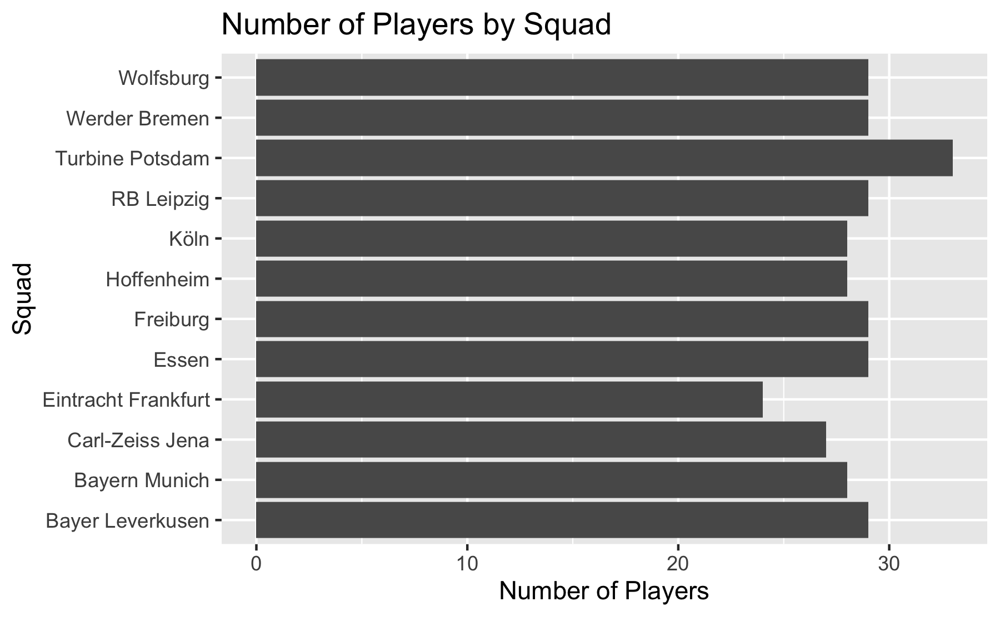
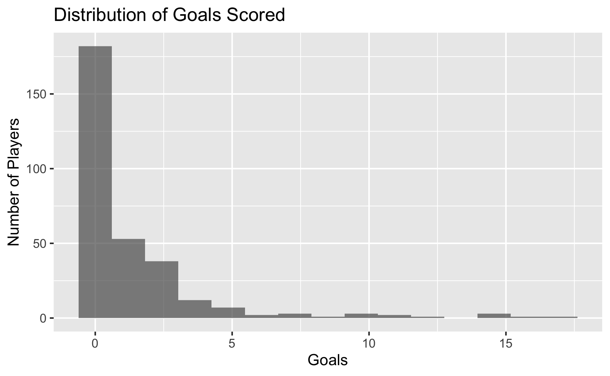
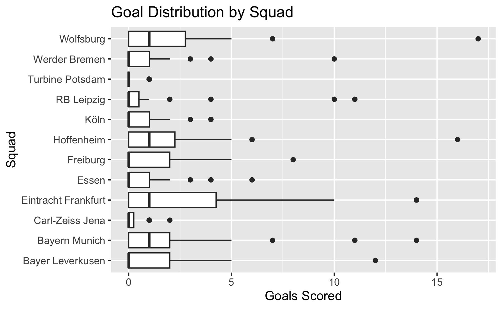

# ggplot2 Basics
Michael Royce
2025-06-20

- [Prerequisites](#prerequisites)
- [<span class="toc-section-number">1</span> Loading
  ggplot2](#loading-ggplot2)
- [<span class="toc-section-number">2</span> Creating ggplot
  Object](#creating-ggplot-object)
- [<span class="toc-section-number">3</span> Assigning and Displaying
  ggplot Objects](#assigning-and-displaying-ggplot-objects)
- [<span class="toc-section-number">4</span> Basic Plot Types: Adding
  Geometries](#basic-plot-types-adding-geometries)
  - [<span class="toc-section-number">4.1</span> Scatter Plot with
    geom_point()](#scatter-plot-with-geom_point)
  - [<span class="toc-section-number">4.2</span> Bar Plot with
    geom_bar()](#bar-plot-with-geom_bar)
  - [<span class="toc-section-number">4.3</span> Histogram with
    geom_histogram()](#histogram-with-geom_histogram)
  - [<span class="toc-section-number">4.4</span> Box Plot with
    geom_boxplot()](#box-plot-with-geom_boxplot)
- [Summary](#summary)
  - [<span class="toc-section-number">4.5</span> ggplot2
    Structure](#ggplot2-structure)
  - [Best Practices](#best-practices)
    - [Always Handle Missing Values
      Explicitly](#always-handle-missing-values-explicitly)
    - [Use Meaningful Labels](#use-meaningful-labels)
    - [Use the Pipe Operator](#use-the-pipe-operator)
  - [Reminders](#reminders)

# Prerequisites

``` r
# Load required libraries
library(dplyr)      # data manipulation (e.g., filter, mutate, summarize)
library(here)       # Builds file paths relative to project root
library(ggplot2)    # data visualization
```

# Loading ggplot2

``` r
# Load ggplot2
library(ggplot2)    # data visualization

# Alternatively: load the tidyverse (which includes ggplot2, dplyr, and other useful packages)
library(tidyverse)
```

Why use ggplot2:

- Uses a “grammar of graphics” approach that breaks plots into intuitive
  building blocks
- Allows you to create hundreds of different plots by learning just a
  handful of components
- Has carefully chosen defaults that create aesthetically pleasing
  graphs
- Works exclusively with tidy data (rows = observations, columns =
  variables)

``` r
# Load the dataset 
frauen_bundesliga_2024_25 <- readRDS(here("data", "processed", "fb_frauen_bundesliga_2024_25.rds"))

# Examine the dataset
glimpse(frauen_bundesliga_2024_25)
```

    Rows: 342
    Columns: 10
    $ Season <chr> "2024-2025", "2024-2025", "2024-2025", "2024-2025", "2024-2025"…
    $ Squad  <chr> "Bayern Munich", "Bayern Munich", "Bayern Munich", "Bayern Muni…
    $ Comp   <chr> "Frauen-Bundesliga", "Frauen-Bundesliga", "Frauen-Bundesliga", …
    $ Player <chr> "Pernille Harder", "Klara Bühl", "Giulia Gwinn", "Carolin Simon…
    $ Nation <chr> "DEN", "GER", "GER", "GER", "ISL", "NOR", "GER", "AUT", "GER", …
    $ Pos    <chr> "FW,MF", "FW,MF", "DF", "DF", "DF", "DF", "FW", "MF", "GK", "MF…
    $ Age    <chr> "31", "23", "25", "31", "29", "26", "26", "31", "20", "25", "24…
    $ MP     <dbl> 22, 22, 19, 22, 18, 20, 22, 17, 12, 12, 17, 10, 18, 16, 11, 16,…
    $ Gls    <dbl> 14, 7, 0, 3, 2, 0, 11, 1, 0, 5, 2, 0, 1, 0, 2, 3, 1, 2, 0, 0, 0…
    $ Ast    <dbl> 5, 13, 1, 4, 2, 2, 3, 0, 0, 3, 4, 0, 2, 0, 0, 2, 0, 1, 0, 0, 0,…

``` r
# Check for missing values in key columns
frauen_bundesliga_2024_25 %>%
  summarise(
    missing_MP = sum(is.na(MP)),
    missing_Gls = sum(is.na(Gls)),
    missing_Ast = sum(is.na(Ast)))
```

      missing_MP missing_Gls missing_Ast
    1         56          33          33

Missing Data in Our Dataset:

- 56 missing values in MP (Matches Played)
- 33 missing values in Gls (Goals)
- 33 missing values in Ast (Assists)

How ggplot2 handles missing values:

- ggplot2 automatically removes rows with missing values (NA) from plots
- You’ll see a warning message like “Removed X rows containing missing
  values”
- This is usually the desired behavior for visualization

The three main components of any ggplot:

1.  Data Component: The dataset being summarized (in our case, the
    frauen_bundesliga_2024_25 data table)
2.  Geometry Component: The type of plot you want to create
    - Scatter plot (geom_point)
    - Bar plot (geom_bar)
    - Histogram (geom_histogram)
    - Box plot (geom_boxplot) And many others
3.  Aesthetic Mapping Component: How variables map to visual elements
    - x-axis and y-axis values (e.g., matches played vs goals scored)
    - Colors, shapes, sizes (e.g., different colors for different
      positions)
    - Text labels (e.g., player names)

Additional components include:

- Scale (axis ranges, log scales, etc.)
- Labels, titles, legends
- Themes/styles

# Creating ggplot Object

``` r
# Using the pipe method to create a ggplot object
frauen_bundesliga_2024_25 %>% ggplot()
```


Both commands create a blank plot with just a gray background. This is
normal and correct! The plot appears blank because no geometry has been
defined yet - we’ve only told ggplot what data to use, but not how to
visualize it.

# Assigning and Displaying ggplot Objects

You can assign a ggplot object to a variable for building plots step by
step.

``` r
# Assign the ggplot object to variable p
p <- frauen_bundesliga_2024_25 %>% ggplot()

# Check what type of object p is
class(p)
```

    [1] "gg"     "ggplot"

``` r
# Display the plot by printing the object
print(p)

# Or more simply, just type the variable name
p
```

Both methods will display the same blank plot with gray background.

- If you don’t assign a ggplot object to a variable, it displays
  automatically
- Assigning to a variable lets you build plots incrementally
- Use the variable name or print() to display assigned ggplot objects
- The pipe method (%\>%) creates a clean, readable workflow
- The next step would be adding geometry (like + geom_point()) to
  actually visualize the data

# Basic Plot Types: Adding Geometries

Now let’s see the different types of plots by adding geometries to our
ggplot object.

## Scatter Plot with geom_point()

``` r
# scatter plot showing Goals vs Assists using pipes
frauen_bundesliga_2024_25 %>%
  filter(!is.na(Gls), !is.na(Ast)) %>%  # Handle missing values explicitly
  ggplot(aes(x = Gls, y = Ast)) +
  geom_point() +  
  labs(
    title = "Goals vs Assists",
    x = "Goals Scored",
    y = "Assists")
```



## Bar Plot with geom_bar()

``` r
# bar plot: comparing number of players by squad
frauen_bundesliga_2024_25 %>%
  ggplot(aes(x = Squad)) +
  geom_bar() +
  coord_flip() +  # Flip for better label readability
  labs(
    title = "Number of Players by Squad",
    x = "Squad",
    y = "Number of Players")
```



## Histogram with geom_histogram()

``` r
# histogram: distribution of goals scored
frauen_bundesliga_2024_25 %>%
  filter(!is.na(Gls)) %>%
  ggplot(aes(x = Gls)) +
  geom_histogram(bins = 15, alpha = 0.7) +  # bins: number of intervals, alpha: transparency level
  labs(
    title = "Distribution of Goals Scored",
    x = "Goals",
    y = "Number of Players")
```



## Box Plot with geom_boxplot()

``` r
# box plot: comparing goals across different squads
frauen_bundesliga_2024_25 %>%
  filter(!is.na(Gls)) %>%
  ggplot(aes(x = Squad, y = Gls)) +
  geom_boxplot() +
  coord_flip() +  # flip the plot
  labs(
    title = "Goal Distribution by Squad",
    x = "Squad",
    y = "Goals Scored")
```



# Summary

## ggplot2 Structure

``` r
data %>%
  filter() %>%           # Handle missing values/filter data
  ggplot(aes()) +        # Set up aesthetics
  geom_*() +             # Add geometry
  labs() +               # Add labels
  theme_*()              # Apply theme
```

## Best Practices

### Always Handle Missing Values Explicitly

``` r
#Be explicit about missing data
frauen_bundesliga_2024_25 %>%
  filter(!is.na(Gls), !is.na(Ast)) %>%  # Clear what you're doing
  ggplot(aes(x = Gls, y = Ast)) +
  geom_point()
```

### Use Meaningful Labels

``` r
# Clear, informative labels
frauen_bundesliga_2024_25 %>%
  filter(!is.na(Gls)) %>%
  ggplot(aes(x = Gls)) +
  geom_histogram(bins = 15) +
  labs(
    title = "Distribution of Goals in Frauen Bundesliga 2024-25",
    x = "Goals Scored",
    y = "Number of Players",
    caption = "Data excludes players with missing goal data"
  )
```

### Use the Pipe Operator

``` r
# tidyverse approach with pipes
frauen_bundesliga_2024_25 %>%
  filter(!is.na(MP), MP > 0) %>%  # Data filtering
  ggplot(aes(x = MP, y = Gls)) +  # Aesthetic mapping
  geom_point(alpha = 0.6) +       # Geometry with transparency
  theme_minimal()                 # Clean theme
```

## Reminders

- Data → Aesthetics → Geometry
- Be transparent about data filtering
- Use coord_flip() for better readability when needed
- Add transparency (alpha) to prevent overplotting
- Choose appropriate bin sizes for histograms
- Use clean themes like theme_minimal()

Reference:

- [ggplot2](https://rafalab.dfci.harvard.edu/dsbook-part-1/dataviz/ggplot2.html)
