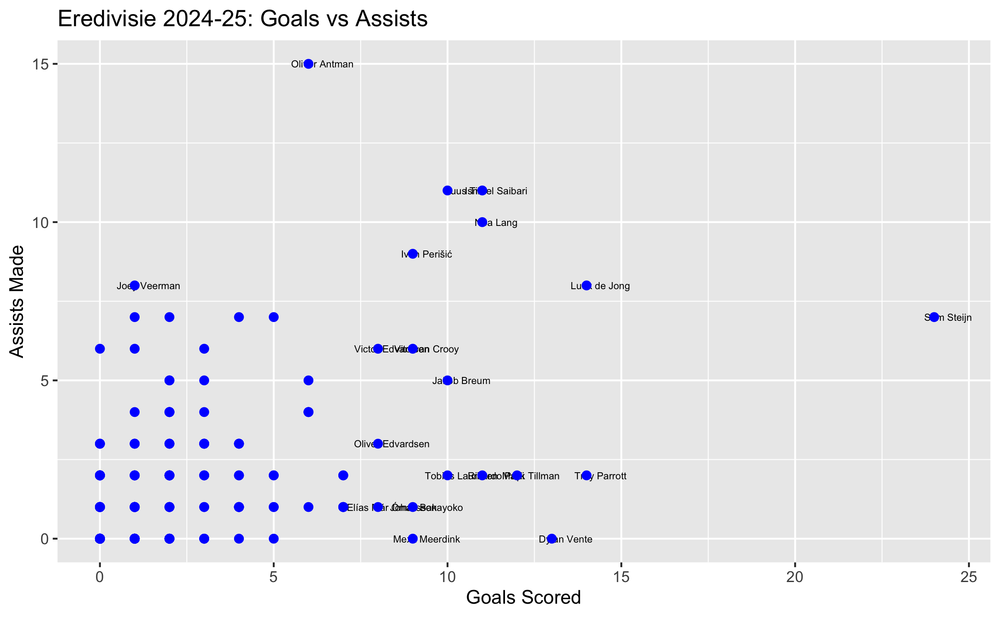
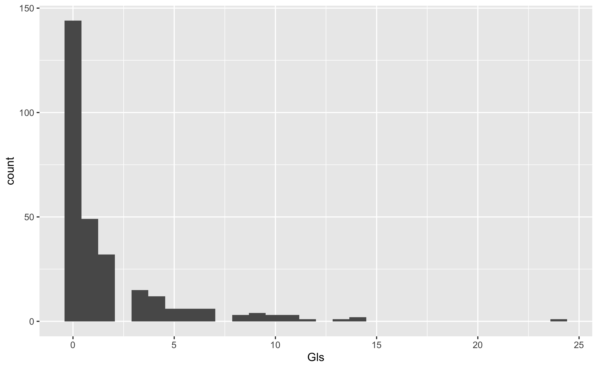

# Customizing Plots in ggplot2
Michael Royce
2025-06-21

- [Prerequisites](#prerequisites)
- [<span class="toc-section-number">1</span> Layers](#layers)
  - [<span class="toc-section-number">1.1</span> ggplot2’s Layer
    System](#ggplot2s-layer-system)
  - [<span class="toc-section-number">1.2</span> Creating our first
    Scatterplot Layer](#creating-our-first-scatterplot-layer)
  - [<span class="toc-section-number">1.3</span> Adding Layers to
    Previously Defined
    Objects](#adding-layers-to-previously-defined-objects)
  - [<span class="toc-section-number">1.4</span> Adding Text Labels to
    Points](#adding-text-labels-to-points)
  - [<span class="toc-section-number">1.5</span> Understanding aes()
    Behavior](#understanding-aes-behavior)
- [<span class="toc-section-number">2</span> Tinkering](#tinkering)
  - [<span class="toc-section-number">2.1</span> Adjusting Point
    Size](#adjusting-point-size)
  - [<span class="toc-section-number">2.2</span> Adjusting Text Label
    Position](#adjusting-text-label-position)
  - [<span class="toc-section-number">2.3</span> Using Global Aesthetic
    Mappings](#using-global-aesthetic-mappings)
  - [<span class="toc-section-number">2.4</span> Local Mappings Override
    Global Ones](#local-mappings-override-global-ones)
- [<span class="toc-section-number">3</span> Scales, Labels, and
  Colors](#scales-labels-and-colors)
  - [<span class="toc-section-number">3.1</span> Converting to Log
    Scale](#converting-to-log-scale)
  - [<span class="toc-section-number">3.2</span> Adding Axis Labels and
    Title](#adding-axis-labels-and-title)
  - [<span class="toc-section-number">3.3</span> Redefining the Plot
    Object](#redefining-the-plot-object)
  - [<span class="toc-section-number">3.4</span> Coloring All Points the
    Same](#coloring-all-points-the-same)
  - [<span class="toc-section-number">3.5</span> Coloring Points by
    Category](#coloring-points-by-category)
  - [<span class="toc-section-number">3.6</span> Adding a Reference
    Line](#adding-a-reference-line)
  - [<span class="toc-section-number">3.7</span> Customizing the
    Reference Line](#customizing-the-reference-line)
  - [<span class="toc-section-number">3.8</span> Customizing the
    Legend](#customizing-the-legend)
- [<span class="toc-section-number">4</span> Add-on
  Packages](#add-on-packages)
  - [<span class="toc-section-number">4.1</span> Applying
    Themes](#applying-themes)
  - [<span class="toc-section-number">4.2</span> Using Better Label
    Positioning](#using-better-label-positioning)
  - [<span class="toc-section-number">4.3</span> Saving Plots with
    here()](#saving-plots-with-here)
- [<span class="toc-section-number">5</span> Other Plots](#other-plots)
  - [<span class="toc-section-number">5.1</span>
    Histograms](#histograms)
  - [<span class="toc-section-number">5.2</span> Density
    Plots](#density-plots)
  - [<span class="toc-section-number">5.3</span> Q-Q Plots](#q-q-plots)
  - [<span class="toc-section-number">5.4</span> Grids of
    Plots](#grids-of-plots)
- [<span class="toc-section-number">6</span> Extras](#extras)

# Prerequisites

loading our necessary libraries and preparing our dataset:

``` r
# Core packages
library(tidyverse)  # Includes: ggplot2, dplyr, tidyr, readr, purrr, tibble, stringr, forcats
library(here)       # For file paths management
library(ggrepel)
library(ggthemes)
library(gridExtra)

# Alternative: Load only what you need (more explicit)
# library(ggplot2)  # For plotting
# library(dplyr)    # For data manipulation
# library(readr)    # For reading data
# library(here)     # For file paths
```

``` r
# Example of using here() for data loading (if reading from file)
eredivisie_2024_25 <- readr::read_csv(here::here("data", "fb_eredivisie_2024_25.csv"))
```

``` r
# Loading our dataset
eredivisie_2024_25 <- readRDS(here::here("data", "processed", "fb_eredivisie_2024_25.rds"))

# Prepare the data using native pipe |> (R 4.1+) or %>%
eredivisie <- eredivisie_2024_25 |>
  dplyr::mutate(Age = as.numeric(Age)) |>                    # Explicit dplyr
  dplyr::filter(!is.na(MP), !is.na(Gls), !is.na(Ast)) |>     # Avoids stats::filter
  dplyr::filter(MP > 0)                                      # Only include players who played matches

glimpse(eredivisie)
```

    Rows: 288
    Columns: 10
    $ Season <chr> "2024-2025", "2024-2025", "2024-2025", "2024-2025", "2024-2025"…
    $ Squad  <chr> "PSV Eindhoven", "PSV Eindhoven", "PSV Eindhoven", "PSV Eindhov…
    $ Comp   <chr> "Eredivisie", "Eredivisie", "Eredivisie", "Eredivisie", "Erediv…
    $ Player <chr> "Walter Benítez", "Ryan Flamingo", "Olivier Boscagli", "Luuk de…
    $ Nation <chr> "ARG", "NED", "FRA", "NED", "NED", "BRA", "NED", "USA", "NED", …
    $ Pos    <chr> "GK", "DF", "DF", "FW", "MF", "DF,MF", "FW", "MF,FW", "MF", "FW…
    $ Age    <dbl> 31, 21, 26, 33, 26, 25, 25, 22, 25, 35, 23, 23, 21, 27, 20, 29,…
    $ MP     <dbl> 34, 34, 30, 31, 32, 25, 29, 26, 27, 27, 24, 29, 30, 18, 15, 12,…
    $ Gls    <dbl> 0, 0, 1, 14, 10, 0, 11, 12, 1, 9, 1, 11, 9, 1, 0, 0, 11, 1, 0, …
    $ Ast    <dbl> 0, 2, 6, 8, 11, 6, 10, 2, 8, 9, 1, 11, 1, 2, 0, 2, 2, 0, 1, 0, …

``` r
# Show labels only for top goal scorers and assist makers
top_performers <- eredivisie |>
  dplyr::filter(Gls >= 8 | Ast >= 8)  # Players with 5+ goals OR 5+ assists
```

# Layers

## ggplot2’s Layer System

In ggplot2, we create graphs by adding layers using the + symbol. The
general structure looks like this:

``` r
# General ggplot structure
DATA |> ggplot() + LAYER_1 + LAYER_2 + ... + LAYER_N
```

## Creating our first Scatterplot Layer

The first layer typically defines the geometry. For scatterplots, we use
`geom_point()`:

``` r
# Basic scatterplot: Goals vs Assists
eredivisie |>
  ggplot() +
  geom_point(aes(x = Gls, y = Ast))
```


- `geom_point()` requires x and y aesthetic mappings
- `aes()` connects data variables to visual properties
- We use `|>` for data operations and `+` for ggplot layers

## Adding Layers to Previously Defined Objects

We can build plots incrementally by adding layers to saved ggplot
objects.

``` r
# Define a base ggplot object
p <- eredivisie |>
  ggplot()

# Add points layer to the predefined object
p + geom_point(aes(Gls, Ast))
```


## Adding Text Labels to Points

To help identify which point corresponds to which player, we add text
labels. Adding player names as labels to each point using `geom_text()`

``` r
# Add text labels showing player names
p + geom_point(aes(Gls, Ast)) +
    geom_text(aes(Gls, Ast, label = Player), size = 3)
```


``` r
# Show labels only for top goal scorers and assist makers
p + geom_point(aes(Gls, Ast)) +
    geom_text(data = top_performers, 
              aes(Gls, Ast, label = Player), 
              size = 3)
```


## Understanding aes() Behavior

Variable names must be used inside aes()

``` r
# This works - Player is inside aes()
p_test <- p + geom_text(aes(Gls, Ast, label = Player))

# This produces an error - Player is outside aes()
# p_test <- p + geom_text(aes(Gls, Ast), label = Player)
```

# Tinkering

## Adjusting Point Size

Making all points larger by setting the size argument outside of
`aes()`.

``` r
# Make points larger (size affects all points equally)
p + geom_point(aes(Gls, Ast), size = 3) +
    geom_text(data = top_performers, 
              aes(Gls, Ast, label = Player), 
              size = 3)
```


## Adjusting Text Label Position

``` r
# Move text labels to the right using nudge_x
p + geom_point(aes(Gls, Ast), size = 3) +
    geom_text(data = top_performers, 
              aes(Gls, Ast, label = Player), 
              size = 3, 
              nudge_x = 3)
```


## Using Global Aesthetic Mappings

Instead of repeating the same mappings in each layer, we can define them
globally:

``` r
# Define global aesthetic mappings
g <- eredivisie |> ggplot(aes(Gls, Ast, label = Player))

# Now layers inherit these mappings
g + geom_point(size = 3) + 
  geom_text(data = top_performers, 
            aes(), 
            size = 3, 
            nudge_x = 3)
```


## Local Mappings Override Global Ones

local aesthetic mappings in individual layers can override global
mappings

``` r
# Local mappings override global mappings
g + geom_point(size = 2) +
    geom_text(aes(x = 20, y = 13, label = "Hi There!"))
```


# Scales, Labels, and Colors

## Converting to Log Scale

``` r
# Method 1: Using scale_x_continuous and scale_y_continuous
g + geom_point(size = 3) +
    geom_text(nudge_x = 0.05) +
    scale_x_continuous(trans = "log10") +
    scale_y_continuous(trans = "log10")

# Method 2: Using specialized log scale functions (more efficient)
g + geom_point(size = 3) +
    geom_text(nudge_x = 0.075) +
    scale_x_log10() +
    scale_y_log10()
```

## Adding Axis Labels and Title

Adding descriptive labels to axes and a main title to the plot.

``` r
g + geom_point(size = 2) + 
  geom_text(data = top_performers, 
            aes(), 
            size = 2, 
            nudge_x = 0.4) + 
  xlab("Goals Scored") +
  ylab("Assists Made") +
  ggtitle("Eredivisie 2024-25: Goals vs Assists")
```


## Redefining the Plot Object

Saves the plot with scales and labels to facilitate adding color and
other elements

``` r
# Define eredivisie_plot to include everything except the points layer
eredivisie_plot <- eredivisie |> 
  ggplot(aes(Gls, Ast, label = Player)) +
  geom_text(data = top_performers, 
            aes(), 
            size = 2, 
            nudge_x = 0.4) + 
  xlab("Goals Scored") +
  ylab("Assists Made") +
  ggtitle("Eredivisie 2024-25: Goals vs Assists")

eredivisie_plot
```


## Coloring All Points the Same

Making all points blue by setting the color argument outside of `aes()`

``` r
# Make all points blue
eredivisie_plot + geom_point(size = 2, color = "blue")
```



## Coloring Points by Category

Colors points by position and automatically adds a legend by mapping the
Pos variable to color.

``` r
# Color points by position (mapping inside aes)
eredivisie_plot + geom_point(aes(col = Pos), size = 3)
```


``` r
# Alternative: Color by team (Squad)
eredivisie_plot + geom_point(aes(col = Squad), size = 3)
```


When we map a categorical variable to color inside aes(), ggplot2
automatically:

- Assigns different colors to each category
- Creates a legend

## Adding a Reference Line

Calculates the average goals-to-assists ratio and adds it as a reference
line

Let’s calculate the average ratio

``` r
# Calculate average goals per assist ratio
avg_ratio <- eredivisie |>
    dplyr::filter(Ast > 0) |>                  # Only players with assists - explicit to avoid stats::filter
    dplyr::summarize(ratio = mean(Gls/Ast, na.rm = TRUE)) |>
    dplyr::pull(ratio)

# Add line showing average ratio
eredivisie_plot + geom_point(aes(col = Squad), size = 3) +
    geom_abline(intercept = 0, slope = avg_ratio)
```


## Customizing the Reference Line

Changing the line to be dashed and dark grey, and places it behind the
points

``` r
# Customize line appearance and layer order
eredivisie_plot + geom_abline(intercept = 0, slope = avg_ratio, lty = 2, color = "darkgrey") +
    geom_point(aes(col = Squad), size = 3)
```


## Customizing the Legend

Improvign the legend title using `scale_color_discrete()`

``` r
eredivisie_plot <- eredivisie_plot + geom_abline(intercept = 0, slope = avg_ratio, lty = 2, color = "darkgrey") + 
  geom_point(aes(col = Squad), size = 3) + 
  scale_color_discrete(name = "Team")

eredivisie_plot
```


# Add-on Packages

## Applying Themes

Changes the overall appearance of the plot using predefined themes

``` r
# Apply the Economist magazine theme
eredivisie_plot + ggthemes::theme_economist()
```


``` r
# FiveThirtyEight website theme
eredivisie_plot + ggthemes::theme_fivethirtyeight()
```


## Using Better Label Positioning

Using `geom_text_repel()` to prevent overlapping labels

``` r
# to prevent overlapping labels
eredivisie |> 
  ggplot(aes(Gls, Ast, label = Player)) +
  ggrepel::geom_text_repel(
      data = top_performers,                    # Only label top performers
      aes(),
      size = 2,
      nudge_x = 0.4,
      max.overlaps = 20) +
  xlab("Goals Scored") +
  ylab("Assists Made") +
  ggtitle("Eredivisie 2024-25: Goals vs Assists") + 
  geom_abline(intercept = 0, slope = avg_ratio, lty = 2, color = "darkgrey") + 
  geom_point(aes(col = Squad), size = 3) + 
  scale_color_discrete(name = "Team")
```


## Saving Plots with here()

``` r
# Create the plot with top performers labeled
eredivisie_goals_assists <- eredivisie |> 
  ggplot(aes(Gls, Ast, label = Player)) +
  ggrepel::geom_text_repel(
      data = top_performers,                    # Only label top performers
      aes(),
      size = 2,
      nudge_x = 0.4,
      max.overlaps = 20) +
  xlab("Goals Scored") +
  ylab("Assists Made") +
  ggtitle("Eredivisie 2024-25: Goals vs Assists") + 
  geom_abline(intercept = 0, slope = avg_ratio, lty = 2, color = "darkgrey") + 
  geom_point(aes(col = Squad), size = 3) + 
  scale_color_discrete(name = "Team")

# Save with here() 
ggplot2::ggsave(
  filename = here::here("figs", "eredivisie_goals_assists.png"),
  plot = eredivisie_goals_assists,
  width = 6,
  height = 6 * 0.618,
  dpi = 300
)

# Alternative formats
ggplot2::ggsave(here::here("figs", "eredivisie_goals_assists.pdf"), eredivisie_goals_assists)
ggplot2::ggsave(here::here("figs", "eredivisie_goals_assists.svg"), eredivisie_goals_assists)
```

# Other Plots

## Histograms

create histograms using `geom_histogram()` with goals data

``` r
# Create histogram of goals scored
eredivisie_hist <- eredivisie |> 
  ggplot(aes(x = Gls))

# Basic histogram
eredivisie_hist + geom_histogram()
```



``` r
# Set binwidth explicitly
eredivisie_hist + geom_histogram(binwidth = 1)
```


``` r
# Customize colors and add labels
eredivisie_hist + 
  geom_histogram(binwidth = 1, fill = "blue", col = "black") +
  xlab("Goals Scored") +
  ggtitle("Distribution of Goals in Eredivisie 2024-25")
```


## Density Plots

``` r
# Basic density plot for assists 
eredivisie |> 
  ggplot(aes(x = Ast)) + 
  geom_density()
```


``` r
# With custom fill color
eredivisie |> 
  ggplot(aes(x = Ast)) +
  geom_density(fill = "blue", alpha = 0.7) +
  xlab("Assists Made") +
  ggtitle("Distribution of Assists in Eredivisie 2024-25")
```


## Q-Q Plots

quantile-quantile plots to assess normality using `geom_qq()`

``` r
# Basic Q-Q plot for goals
eredivisie |> 
  ggplot(aes(sample = Gls)) + 
  geom_qq()
```


``` r
# Q-Q plot against normal distribution with same mean/sd as data
params <- eredivisie |>
    dplyr::summarize(mean = mean(Gls), sd = sd(Gls))

eredivisie |> 
  ggplot(aes(sample = Gls)) + 
  geom_qq(dparams = params) + 
  geom_abline() +                      # adds identity line
  ggtitle("Q-Q Plot: Goals vs Normal Distribution")
```


## Grids of Plots

Displays multiple plots side by side

``` r
# Create different visualizations
p1 <- eredivisie |>
      ggplot(aes(x = Gls)) +
      geom_histogram(binwidth = 1, fill = "blue", col = "black") +
      ggtitle("Goals Distribution")

p2 <- eredivisie |>
      ggplot(aes(x = Ast)) +
      geom_histogram(binwidth = 1, fill = "red", col = "black") +
      ggtitle("Assists Distribution")

p3 <- eredivisie |>
      ggplot(aes(x = Age)) +
      geom_histogram(binwidth = 1, fill = "green", col = "black") +
      ggtitle("Age Distribution")

# Arrange plots using explicit notation
combined_plot <- gridExtra::grid.arrange(p1, p2, p3, ncol = 3)
```


# Extras

``` r
# Filter top performers for labeling
efficient_scorers <- eredivisie |>
  dplyr::filter(MP >= 8) |>  # Minimum games played
  dplyr::mutate(goals_per_game = Gls / MP) |>
  dplyr::filter(goals_per_game >= 0.5)  # At least 0.5 goals per game

eredivisie |>
  ggplot(aes(MP, Gls, label = Player)) +
  geom_point(aes(col = Squad), size = 3) +
  ggrepel::geom_text_repel(
    data = efficient_scorers,
    aes(label = Player),
    max.overlaps = 15) +
  xlab("Matches Played") +
  ylab("Goals Scored") +
  ggtitle("Goal Scoring vs Playing Time") +
  scale_color_discrete(name = "Team") +
  theme_minimal()
```


``` r
# Filter for top teams
top_teams <- c("PSV Eindhoven", "Ajax", "Feyenoord", "AZ Alkmaar", "Zwolle")

# Get top performers from each team for labeling
top_team_performers <- eredivisie |>
    dplyr::filter(Squad %in% top_teams) |>
    dplyr::group_by(Squad) |>
    dplyr::slice_max(order_by = Gls + Ast, n = 3) |>  # Top 3 per team
    dplyr::ungroup()

eredivisie |>
  dplyr::filter(Squad %in% top_teams) |>             
  ggplot(aes(Gls, Ast, label = Player)) +
  geom_point(aes(col = Squad), size = 3) +
  ggrepel::geom_text_repel(
    data = top_team_performers,
    aes(label = Player),
    max.overlaps = 15) +
  facet_wrap(~Squad) +
  xlab("Goals") +
  ylab("Assists") +
  ggtitle("Goals vs Assists by Top Teams") +
  scale_color_discrete(name = "Team") +
  theme_bw()
```


``` r
# Create analysis summary by team
analysis_summary <- eredivisie |>
  dplyr::group_by(Squad) |>
  dplyr::summarise(
    total_goals = sum(Gls, na.rm = TRUE),
    total_assists = sum(Ast, na.rm = TRUE),
    avg_age = mean(Age, na.rm = TRUE),
    players = n(),
    .groups = "drop") |>
  dplyr::arrange(dplyr::desc(total_goals))

analysis_summary
```

    # A tibble: 10 × 5
       Squad            total_goals total_assists avg_age players
       <chr>                  <dbl>         <dbl>   <dbl>   <int>
     1 PSV Eindhoven             99            85    24.2      32
     2 Twente                    61            43    24.2      29
     3 AZ Alkmaar                57            43    22.5      30
     4 Go Ahead Eagles           57            45    23.6      28
     5 NEC Nijmegen              51            31    24.8      25
     6 Zwolle                    42            28    23.9      26
     7 Groningen                 39            25    23.7      29
     8 Sparta Rotterdam          38            29    23.8      29
     9 Fortuna Sittard           36            25    24.9      30
    10 NAC Breda                 34            22    24.8      30

``` r
# Get top teams for labeling
top_scoring_teams <- analysis_summary |>
  dplyr::slice_head(n = 8)  # Top 8 teams

# Create summary plot
analysis_summary |>
  ggplot(aes(x = total_goals, y = total_assists, label = Squad)) +
  geom_point(aes(col = Squad), size = 4, alpha = 0.7) +
  ggrepel::geom_text_repel(
    data = top_scoring_teams,
    aes(label = Squad),
    max.overlaps = 10) +
  xlab("Total Goals") +
  ylab("Total Assists") +
  ggtitle("Team Performance: Goals vs Assists") +
  scale_color_discrete(name = "Team") +
  theme_minimal()
```


