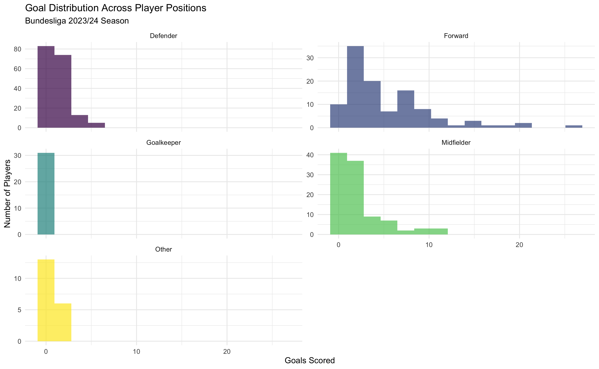
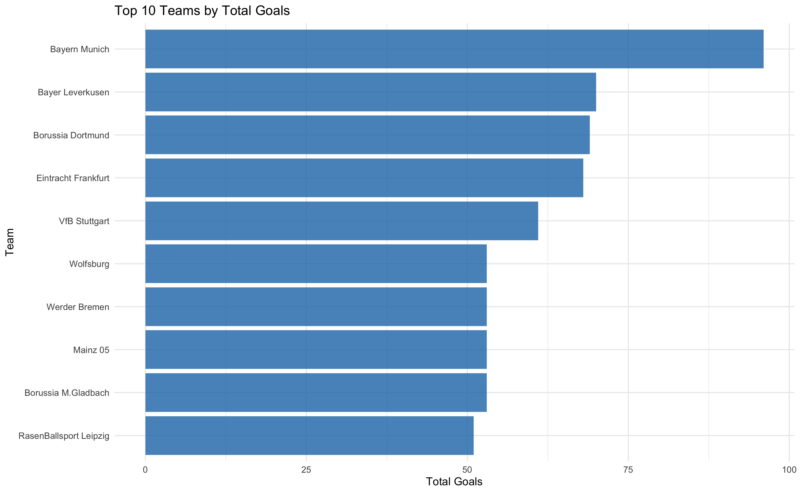
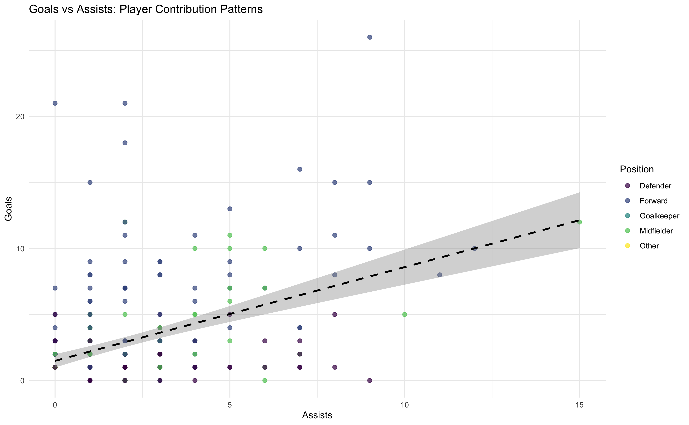
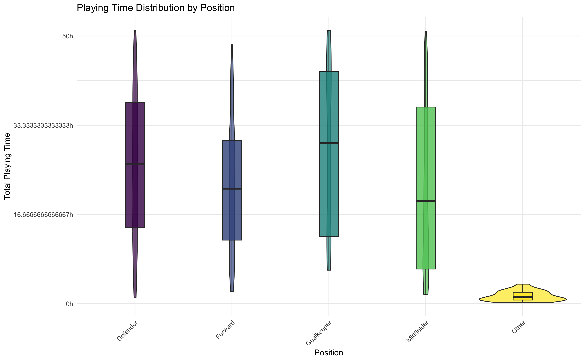
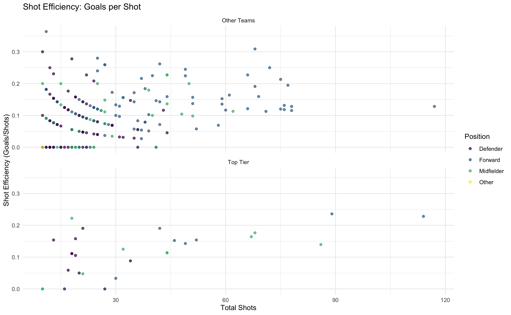
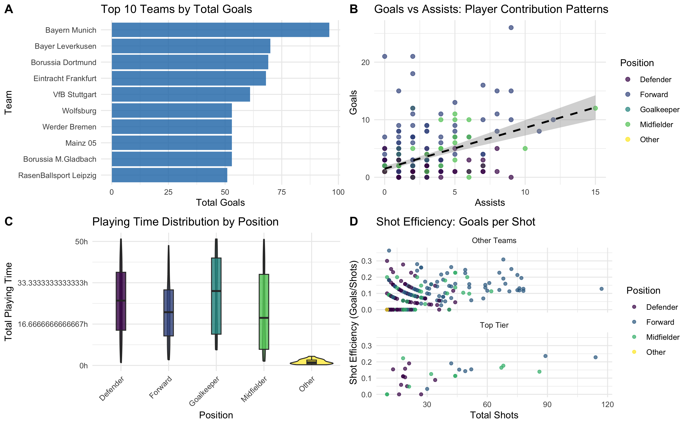

# Multi-Panel Plots and Plot Export in R
Michael Royce
2025-06-21

- [Prerequisites](#prerequisites)
  - [<span class="toc-section-number">0.1</span> Data Preparation and
    Exploration](#data-preparation-and-exploration)
- [<span class="toc-section-number">1</span> Understanding Multi-Panel
  Plot Concepts](#understanding-multi-panel-plot-concepts)
  - [<span class="toc-section-number">1.1</span> Faceting](#faceting)
- [<span class="toc-section-number">2</span> Combining Different Plot
  Types](#combining-different-plot-types)
  - [<span class="toc-section-number">2.1</span> Creating Plot
    Objects](#creating-plot-objects)
  - [<span class="toc-section-number">2.2</span> Building with
    ggarrange](#building-with-ggarrange)
- [<span class="toc-section-number">3</span> Exporting Plots for
  Sharing](#exporting-plots-for-sharing)
  - [<span class="toc-section-number">3.1</span> Quick Export
    Options](#quick-export-options)
- [Summary](#summary)

# Prerequisites

``` r
# Load required libraries
library(ggplot2)    # Core plotting functionality
library(ggpubr)     # For ggarrange function
library(dplyr)      # Data manipulation
library(here)       # Reproducible file paths
library(stringr)    # String manipulation for position cleaning
```

## Data Preparation and Exploration

Prepares the Bundesliga datasets for visualization by cleaning position
data and creating meaningful groupings.

``` r
# load dataset
bundesliga_players_stats <- readRDS(here("data", "raw", "ustats_bundesliga_players_stats_2024_25.rds"))

# remove "S" in position
bundesliga_players_stats$position <- bundesliga_players_stats$position %>%
  str_remove_all("S") %>%
  str_squish()  # Removes extra whitespace and trims
```

``` r
# Clean and prepare the player stats dataset
bundesliga_players <- bundesliga_players_stats |>
  
  # Create simplified position categories
  mutate(
    position_simple = case_when(
      is.na(position) ~ "NA",
      str_detect(position, "GK") ~ "Goalkeeper",
      str_detect(position, "F") ~ "Forward",
      str_detect(position, "D") ~ "Defender",
      str_detect(position, "M") ~ "Midfielder",
      TRUE ~ "Other"),
    # Calculate goals per game ratio
    goals_per_game = goals / games,
    # Create playing time categories
    time_category = case_when(
      time < 500 ~ "Limited",
      time < 1500 ~ "Regular",
      time >= 1500 ~ "Key Player")) |>
  
  # Filter out players with very few games
  dplyr::filter(games >= 5)

# Preview the enhanced dataset
glimpse(bundesliga_players)
```

# Understanding Multi-Panel Plot Concepts

## Faceting

What this does: Creates multiple panels of the same plot type,
maintaining consistent axes, scales, and styling across panels for easy
comparison. Faceting maintains identical axis limits and styling across
all panels, making it easy to spot differences in distribution patterns
between groups.

we want to compare scoring patterns AND each position has different
offensive expectations, BUT separate plots would use different scales,
THEREFORE faceting provides consistent comparison frameworks.

``` r
# Create a faceted histogram showing goals distribution by position
goals_by_position_facet <- bundesliga_players |>
  ggplot(aes(x = goals, fill = position_simple)) +
  geom_histogram(bins = 15, alpha = 0.7) +
  facet_wrap(~ position_simple,
             ncol = 2,
             scales = "free_y") +  # Allow different y-scales since player counts vary
  scale_fill_viridis_d(name = "Position") +
  labs(
    title = "Goal Distribution Across Player Positions",
    subtitle = "Bundesliga 2023/24 Season",
    x = "Goals Scored",
    y = "Number of Players") +
  theme_minimal() +
  theme(legend.position = "none")  # Remove legend since facet labels provide info

# Display the plot
goals_by_position_facet
```



# Combining Different Plot Types

## Creating Plot Objects

Just as we assign datasets to objects, we can assign entire plots. This
becomes essential when building composite figures or when we need to
modify plots systematically, as reusable objects, enabling modular plot
building and complex arrangements.

Plot objects appear in your environment as “gg” type objects, containing
all the layers and specifications. This modular approach lets you build
complex figures systematically and modify individual components without
rebuilding everything.

Generates individual plot objects focusing on different aspects that can
be combined into comprehensive dashboards.

``` r
# Plot 1: Team goal distribution (bar plot)
team_goals_plot <- bundesliga_players |>
  group_by(team_name) |>
  summarise(
    total_goals = sum(goals, na.rm = TRUE),
    total_players = n(),
    .groups = "drop") |>
  slice_max(total_goals, n = 10) |>  # Top 10 scoring teams
  ggplot(aes(x = reorder(team_name, total_goals), y = total_goals)) +
  geom_col(fill = "#1f77b4", alpha = 0.8) +
  coord_flip() +
  labs(
    title = "Top 10 Teams by Total Goals",
    x = "Team",
    y = "Total Goals") +
  theme_minimal()

team_goals_plot
```



``` r
# Plot 2: Goals vs Assists relationship (scatter plot)
goals_assists_scatter <- bundesliga_players |>
  dplyr::filter(goals > 0 | assists > 0) |>  # Focus on players with offensive contributions
  ggplot(aes(x = assists, y = goals, color = position_simple)) +
  geom_point(alpha = 0.7, size = 2) +
  geom_smooth(method = "lm", se = TRUE, color = "black", linetype = "dashed") +
  scale_color_viridis_d(name = "Position") +
  labs(
    title = "Goals vs Assists: Player Contribution Patterns",
    x = "Assists",
    y = "Goals") +
  theme_minimal()

goals_assists_scatter
```



``` r
# Plot 3: Playing time distribution by position (violin plot)
playing_time_violin <- bundesliga_players |>
  ggplot(aes(x = position_simple, y = time, fill = position_simple)) +
  geom_violin(alpha = 0.7) +
  geom_boxplot(width = 0.2, alpha = 0.8, outlier.shape = NA) +
  scale_fill_viridis_d(name = "Position") +
  scale_y_continuous(labels = function(x) paste0(x/60, "h")) +  # Convert minutes to hours
  labs(
    title = "Playing Time Distribution by Position",
    x = "Position",
    y = "Total Playing Time") +
  theme_minimal() +
  theme(
    axis.text.x = element_text(angle = 45, hjust = 1),
    legend.position = "none")

playing_time_violin
```



``` r
# Plot 4: Shot efficiency analysis (faceted by team category)
shot_efficiency_facet <- bundesliga_players |>
  mutate(
    shot_efficiency = ifelse(shots > 0, goals / shots, 0),
    team_category = case_when(
      team_name %in% c("Bayern Munich", "Borussia Dortmund", "RB Leipzig") ~ "Top Tier",
      TRUE ~ "Other Teams")) |>
  dplyr::filter(shots >= 10) |>  # Players with meaningful shot counts
  ggplot(aes(x = shots, y = shot_efficiency, color = position_simple)) +
  geom_point(alpha = 0.7) +
  facet_wrap(~ team_category, ncol = 1) +
  scale_color_viridis_d(name = "Position") +
  labs(
    title = "Shot Efficiency: Goals per Shot",
    x = "Total Shots",
    y = "Shot Efficiency (Goals/Shots)") +
  theme_minimal()

shot_efficiency_facet
```



Each plot object captures a different dimension of football
performance - team strength, individual creativity, positional demands,
and shooting quality, modular approach.

## Building with ggarrange

The ggarrange() function excels when you need to combine different plot
types - unlike faceting, which works with identical plot structures.

**Creating the Dashboard** Combines multiple analysis perspectives into
a single, publication-ready dashboard that tells a complete story

``` r
# Combine all analyses into a comprehensive football dashboard
football_dashboard <- ggarrange(
  team_goals_plot,           # Panel A: Team offensive strength
  goals_assists_scatter,     # Panel B: Individual creativity patterns
  playing_time_violin,       # Panel C: Positional workload analysis
  shot_efficiency_facet,     # Panel D: Shooting quality by team tier
  ncol = 2,
  nrow = 2,
  labels = c("A", "B", "C", "D"),
  font.label = list(size = 14, color = "black", face = "bold"))

# Display the complete dashboard
football_dashboard
```



# Exporting Plots for Sharing

## Quick Export Options

Method 1: R Markdown Integration

- knit your R Markdown document
- Plots will appear in the output (Word, PDF, HTML)

Method 2: Right-click Export

- Right-click any plot in your R session
- Select “Copy Plot”
- Paste directly into other applications

Method 3: RStudio Plots Panel

- Navigate to the Plots tab
- Click “Export” button
- Choose “Save as Image” or “Save as PDF”

Export for Different Audiences

The ggsave() function offers the most robust approach for creating
publication-quality exports with exact specifications.

Create PDF versions for editors and print publications (high DPI), and
PNG versions for PowerPoint and screen viewing (moderate DPI, smaller
file size).

``` r
# Export high-resolution version
ggsave(
  filename = here::here("figs", "bundesliga_comprehensive_dashboard.pdf"),
  plot = football_dashboard,
  width = 16,           # Wide format for detailed analysis
  height = 12,           # Adequate height for readability
  dpi = 300)              # Print-quality resolution

# Export presentation-friendly version 
ggsave(
  filename = here::here("figs", "bundesliga_dashboard_presentation.png"),
  plot = football_dashboard,
  width = 10,
  height = 10 * 0.618,    # landscape-oriented plots
  dpi = 150)              # Screen-optimized resolution

# Export individual plots 
ggsave(
  filename = here::here("figs", "goals_assists_analysis.png"),
  plot = goals_assists_scatter,
  width = 6,
  height = 6 * 0.75,      # for square-ish plots
  dpi = 30)

# Quick export
ggsave(
  filename = here::here("figs", "team_goals_summary.png"),
  plot = team_goals_plot,
  width = 8,
  height = 8 * 1.618,      # for portrait-oriented plots (1/0.618 ≈ 1.618)
  dpi = 150)
```

Golden Ratio

- width = 8, then height = 8 \* 0.618 = 6.18 for landscape-oriented
  plots
- width = 8, then height = 8 \* 1.618 = 6.18 for portrait-oriented plots
- width = 8, then height = 8 \* 0.75 = 6.18 for square-ish plots

# Summary

Multi-Panel Plotting

- Faceting (facet_wrap) - Creates consistent multi-panel plots when
  comparing the same visualization across groups
- Plot Objects - Assign plots to variables for modular building and
  reuse
- Plot Combination (ggarrange) - Assembles different plot types into
  sophisticated multi-panel figures
- Professional Export (ggsave) - Provides precise control over output
  format, resolution, and dimensions

medical research, business analytics, environmental data, or any domain

Reference:

- 
